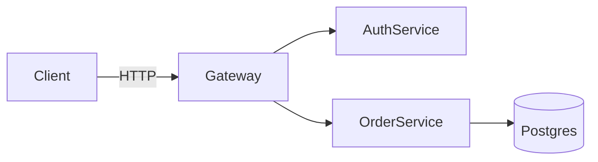
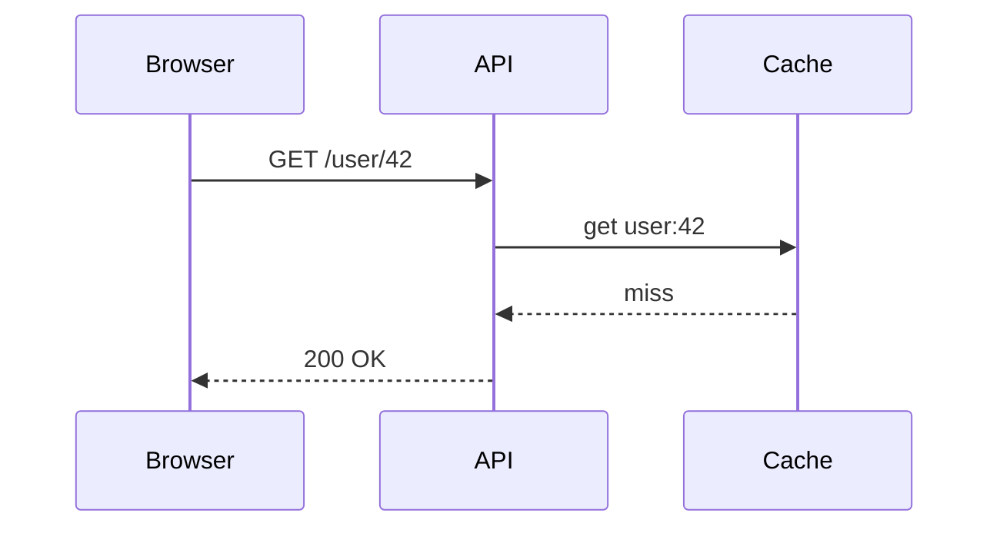
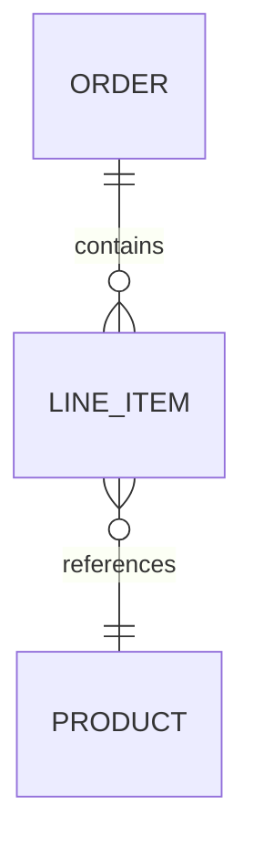

@chapter
id: cpe-ch06-diagrams-as-code
order: 6
title: Diagrams That Don't Rot
summary: Diagrams-as-code: version-controlled, PR-reviewable, and still readable when the system changes — why Mermaid, PlantUML, Structurizr, and Excalidraw beat drag-and-drop tools for long-lived architecture documentation.

@card
id: cpe-ch06-c001
order: 1
title: Why Diagrams Rot
teaser: A diagram is correct on the day it's drawn. After the next refactor, it becomes a liability — confidently wrong about a system that no longer exists.

@explanation

Diagrams rot because they live in a different place than code. Code lives in git. Diagrams live in Confluence, Lucidchart, a Miro board, or a folder of `.drawio` files that nobody remembers the password to. When an engineer changes how the auth service routes tokens, they update the code, they update the tests, they maybe update the README. They do not open Lucidchart.

This creates a specific kind of trust problem:

- New engineers read the architecture diagram and build a mental model of the system.
- The mental model is wrong because the diagram is six months behind.
- They ask questions that confuse their colleagues, who forgot the diagram exists.
- Someone eventually adds a sticky note that says "outdated" and moves on.

The update gap is structural. Diagram tools are decoupled from code review. There's no diff, no reviewer, no CI check. Nothing forces the diagram to stay in sync with the system it describes.

The failure mode compounds over time. A diagram that's three weeks stale is a minor annoyance. A diagram that's two years stale is actively dangerous — it will mislead an incident responder at the worst possible moment.

> [!warning] A confidently wrong diagram is worse than no diagram. At least a missing diagram prompts the reader to go read the code.

@feynman

Like a map printed before the road was rerouted — the map looks authoritative, but following it leads you somewhere the road no longer goes.

@card
id: cpe-ch06-c002
order: 2
title: Diagrams-as-Code: The Principle
teaser: Text-defined diagrams live in the same repository as the code they describe, get reviewed in the same PR, and rot at the same rate — which is nearly zero.

@explanation

Diagrams-as-code is the practice of defining diagrams in plain text — a DSL or markup language — so that the diagram source file lives in version control alongside the code it describes.

The core insight is that a diagram is documentation, and documentation should follow the same workflow as code:

- Written in a text file checked into the repo.
- Changed in a branch alongside the code change that makes it necessary.
- Reviewed in the pull request by the same engineers who review the code.
- Diffable — a reviewer can see exactly what changed between the old and new diagram.
- Rendered automatically — the image is generated from the text, not maintained separately.

What this buys you:

- The diagram change and the code change are atomic. If the code lands, the diagram lands. If the PR is reverted, the diagram reverts.
- No separate tool access to manage. Any engineer who can open the repo can read and edit the diagram source.
- History is preserved. `git log` and `git blame` work on diagram files the same as on source files.
- Reviews are meaningful. A diff showing that a service connection was removed is a concrete signal, not a vague "updated diagram" comment.

The constraint is that the text DSL limits what you can express. Most architecture diagrams fit comfortably within that constraint. The ones that don't are usually trying to communicate too much in a single diagram.

> [!info] The rendered image is a build artifact. The text source is the asset. Commit the source; generate the image.

@feynman

Same principle as infrastructure-as-code: the real resource is the text definition in git, and the running system is what gets generated from it.

@card
id: cpe-ch06-c003
order: 3
title: Mermaid: Syntax and Native Rendering
teaser: Mermaid is the most widely adopted diagrams-as-code tool because GitHub renders it natively in Markdown — zero setup, zero build step for the most common case.

@explanation

Mermaid is a JavaScript-based diagramming DSL that GitHub, GitLab, and many documentation platforms render natively inside Markdown code blocks tagged `mermaid`. This makes it the lowest-friction starting point for most teams.

The core syntax is readable enough to write and review without a preview. A flowchart:



A sequence diagram — one of Mermaid's strongest formats:



An ER diagram for data modeling discussions:



What Mermaid covers well:
- Flowcharts and decision trees
- Sequence and interaction diagrams
- Entity-relationship diagrams
- State machines
- Gantt charts for rough milestone communication

The native GitHub rendering means a `README.md` with a Mermaid block becomes a living diagram with no external tool, no exported image file, and no access management.

> [!tip] Put Mermaid diagrams directly in `README.md` or `docs/` Markdown files. They render in GitHub's file viewer, in PRs, and in most static site generators without any extra configuration.

@feynman

Like writing SQL instead of using a drag-and-drop query builder — the text version is slightly less visual to write but far more portable and diffable.

@card
id: cpe-ch06-c004
order: 4
title: Mermaid in Practice: The Useful Subset and Its Limits
teaser: Mermaid is excellent for 70% of the diagrams engineers actually draw — and noticeably awkward for the remaining 30%.

@explanation

Most teams converge on a working subset of Mermaid quickly. The diagrams that work well in practice:

- Flowcharts for system overview and request paths.
- Sequence diagrams for protocol and API interaction documentation.
- State diagrams for finite state machines (auth flows, order states, retry logic).
- ER diagrams for data model conversations.

Where Mermaid struggles:

- **Complex node placement.** Mermaid's layout engine is automatic. You cannot control where nodes land spatially. For diagrams where position conveys meaning (e.g., a network topology with physical zones), this is a hard limit.
- **Large diagrams.** Past roughly 20 nodes, Mermaid flowcharts become crowded and the layout engine makes questionable choices. The correct response is to split the diagram, not to fight the layout.
- **Subgraphs at scale.** Nested subgraphs are supported but become fragile as complexity grows. Styling them consistently is manual and verbose.
- **C4 model notation.** Mermaid supports a `C4Context` diagram type, but it's not widely used and lacks the maturity of dedicated C4 tools.
- **Rendering inconsistency.** Different Mermaid versions render identically-written diagrams differently. If your team upgrades the Mermaid library, previously fine diagrams may reflow unexpectedly.

The honest position: Mermaid is the right default. Switch to a different tool when you hit a limit it genuinely can't handle, not when you want more visual control.

> [!warning] Mermaid's auto-layout is its biggest source of frustration. If you spend more than ten minutes fighting node positions, you either have a diagram that's too large, or you need a different tool.

@feynman

Like using a terminal text editor for code — great for most things, deliberately limited for others, and the constraint often improves the output by preventing over-engineering.

@card
id: cpe-ch06-c005
order: 5
title: PlantUML: Richer Notation and C4 Support
teaser: PlantUML has been around longer, covers more diagram types with formal notation, and has a mature C4 standard library — at the cost of needing a server or local install to render.

@explanation

PlantUML is the older and more feature-complete alternative to Mermaid. It supports everything Mermaid does and adds:

- Formal UML sequence, class, component, deployment, and activity diagrams with correct UML notation.
- `!include` directives for sharing common elements across diagram files.
- The C4-PlantUML standard library (`C4_Context.puml`, `C4_Container.puml`, `C4_Component.puml`) for structured architecture documentation.

When PlantUML is the better choice over Mermaid:

- You need UML-compliant class or deployment diagrams (e.g., for enterprise architecture documentation, RFCs, or regulatory review).
- You're documenting architecture at multiple abstraction levels using C4 and want the full C4 notation with correct element types (Person, System, Container, Component).
- You have diagram fragments that repeat across multiple files and want to `!include` a shared component definition.

The tradeoff: PlantUML does not render natively in GitHub Markdown. You need either a PlantUML server, a local Java install, or a CI step to generate the images. This is a real friction cost for teams without an existing documentation build pipeline.

A minimal C4 container diagram in PlantUML:

```plantuml
!include C4_Container.puml
Person(user, "User", "Browser or mobile client")
System_Boundary(api, "API Layer") {
    Container(gateway, "API Gateway", "Node.js")
    Container(auth, "Auth Service", "Go")
}
Rel(user, gateway, "HTTPS")
Rel(gateway, auth, "gRPC")
```

@feynman

Like LaTeX versus Markdown — more verbose, requires a build step, but gives you precise control over formal notation that Markdown can't express.

@card
id: cpe-ch06-c006
order: 6
title: Structurizr: C4-Native DSL and Multi-View Documentation
teaser: Structurizr defines the architecture model once and renders multiple C4 views from it — system context, containers, components, and deployment — from a single source of truth.

@explanation

Structurizr is purpose-built for the C4 model. Where PlantUML requires you to write each C4 diagram independently, Structurizr uses a workspace model: you define the system's elements and relationships once, then declare which views to render.

The Structurizr DSL:

```
workspace {
    model {
        user = person "User"
        system = softwareSystem "StackSpeak" {
            api = container "API" "Go"
            db = container "Database" "PostgreSQL"
        }
        user -> api "Uses"
        api -> db "Reads/writes"
    }
    views {
        systemContext system "SystemContext" {
            include *
        }
        container system "Containers" {
            include *
        }
    }
}
```

From one workspace file, Structurizr generates the system context view, the container view, and any component or deployment views you declare. When a relationship changes, you update it once and all views that include it are updated.

What Structurizr adds beyond PlantUML for C4:

- Single model definition, multiple rendered views.
- Structurizr Lite is a free Docker image that renders locally with live preview.
- The `.dsl` file is plain text and fully version-controllable.
- Automatic consistency — if you remove a service from the model, it disappears from every view simultaneously.

The cost: more upfront to understand the workspace model concept. Structurizr is the right choice when you're building architecture documentation intended to last and be maintained, not when you need a quick diagram for a PR description.

> [!info] Structurizr Lite runs as a Docker container on localhost. The DSL file sits in your repo; the container reads it directly. No separate server to manage for local development.

@feynman

Like a database schema versus individual data files — define the relationships once in a normalized model, then generate as many views as you need from the same source.

@card
id: cpe-ch06-c007
order: 7
title: Excalidraw: Collaborative Whiteboarding for In-Progress Thinking
teaser: Excalidraw's hand-drawn aesthetic is a feature — it signals that the diagram is exploratory, not authoritative, which changes how people engage with it.

@explanation

Excalidraw is a browser-based whiteboarding tool with a hand-drawn visual style. It saves to a JSON file (`*.excalidraw`) that is human-readable and version-controllable. This makes it different from Lucidchart or Figma, where the source format is binary or proprietary.

Where Excalidraw fits in the diagrams-as-code ecosystem:

- **Design sessions and brainstorming.** The hand-drawn look signals "this is thinking in progress." Participants engage differently with a rough sketch than with a polished architecture diagram — they're more willing to say "that's wrong" and redraw.
- **Incident retrospectives.** During an incident, collaborative whiteboarding is faster than any DSL. Excalidraw in a shared browser session or VS Code Live Share gets everyone drawing the same mental model in real time.
- **Non-final documentation.** RFCs and design proposals benefit from "this is a sketch" framing. A polished PlantUML diagram in an RFC implies more certainty than often exists.

The `.excalidraw` JSON file can be committed to git. Diffs are ugly (it's JSON describing geometric coordinates) but the file is auditable and the history is preserved.

What Excalidraw is not:

- Not appropriate for authoritative architecture documentation that new engineers will rely on.
- Not appropriate for documentation that needs to stay in sync with code automatically.
- Not a replacement for diagrams-as-code tools in a production docs workflow.

> [!tip] Commit the `.excalidraw` source file alongside any PNG export. The PNG is readable anywhere; the source file is editable. Tag the diagram in the filename as `draft` or `rfc` to communicate its intent.

@feynman

Like a whiteboard photo in a design doc — valuable for capturing thinking, clearly not the final specification.

@card
id: cpe-ch06-c008
order: 8
title: D2 and the Growing Ecosystem
teaser: D2 is a newer diagrams-as-code language with better layout control than Mermaid and no Java dependency — worth knowing when Mermaid's layout engine frustrates you.

@explanation

The diagrams-as-code space has expanded significantly beyond Mermaid and PlantUML. D2 (Declarative Diagramming) is the most notable recent entrant.

D2 advantages over Mermaid:

- More control over layout: D2 supports multiple layout engines (dagre, elk, tala) and lets you choose per-diagram.
- Cleaner syntax for nested objects and relationships.
- Built-in support for classes on nodes for consistent visual styling.
- No JavaScript or Java runtime — it's a single compiled binary.

A D2 example:

```d2
gateway: API Gateway
auth: Auth Service
orders: Order Service
db: Postgres {shape: cylinder}

gateway -> auth: token validation
gateway -> orders: route
orders -> db: query
```

Other tools worth knowing:

- **Graphviz (DOT language):** the original text-to-diagram tool. Still the best choice for dependency graphs and call graphs generated programmatically from code.
- **Kroki:** a rendering server that supports 20+ diagram types (Mermaid, PlantUML, D2, Graphviz, and more) from a single HTTP endpoint, useful for CI pipelines.
- **Diagrams (Python library):** generates cloud architecture diagrams from Python code, useful when the diagram is derived from infrastructure configuration.

When to look beyond Mermaid:

- Layout engine frustration that splitting the diagram doesn't resolve.
- Need for a binary install in a minimal CI environment (no Node.js or Java).
- Diagrams generated programmatically from data rather than written by hand.

@feynman

Like the progression from Make to CMake to Bazel — each tool solved real limits of the previous one; knowing the landscape helps you pick the right level of complexity.

@card
id: cpe-ch06-c009
order: 9
title: The Diagram-in-PR Workflow
teaser: The moment diagram changes become part of the PR that changes the code, diagrams stop being a separate documentation artifact and start being a reviewable constraint on the design.

@explanation

The diagram-in-PR workflow is the operational practice that makes diagrams-as-code actually work. The principle: any PR that changes a system boundary, adds a service, removes a dependency, or modifies a protocol must also update the relevant diagram.

How to implement this:

- Store diagram source files in the repo, colocated with the code they describe or in a `/docs` directory.
- Include diagram changes in the same PR as the code change — not a follow-up "docs cleanup" PR that never ships.
- Make diagram review part of the PR checklist. Reviewers should check that the diagram reflects the changed code, not just that the code is correct.

What this looks like in a PR:

- A diff in `docs/architecture/containers.mmd` showing a new `CacheService` node added and a direct DB connection from `APIGateway` replaced by `APIGateway -> CacheService -> DB`.
- Reviewers can confirm the diagram matches the code being introduced without opening an external tool.

The forcing function: if the team requires a diagram diff for any PR that changes service topology, engineers will maintain diagrams because the PR won't pass review without it. The workflow creates the incentive that good intentions don't.

A practical convention for large repos:

- One diagram per service or subsystem, not one global architecture diagram.
- Global diagrams at the system-context and container level (C4 L1/L2) update rarely. Component-level diagrams (C4 L3) are colocated with the service they describe.

> [!tip] A CODEOWNERS rule on diagram source files ensures that architecture-aware reviewers are automatically added to PRs that touch diagrams — the same way you'd CODEOWNERS a security-sensitive config file.

@feynman

Like requiring a migration alongside a schema change — the constraint is the point, and the constraint is what keeps the artifact in sync.

@card
id: cpe-ch06-c010
order: 10
title: CI Rendering: Auto-Generating Diagram Images for Docs Sites
teaser: The text source is what you commit; the image is what you publish — a CI step bridges the two, so rendered diagrams on docs sites are always derived from the latest source.

@explanation

For documentation sites (GitHub Pages, Docusaurus, Notion embeds, or internal wikis), you need rendered images, not raw DSL source. CI rendering automates this: on every merge to the main branch, a pipeline renders all diagram source files to PNG or SVG and commits or publishes the results.

A minimal GitHub Actions workflow for Mermaid:

```yaml
- name: Render Mermaid diagrams
  uses: actions/setup-node@v4
  with:
    node-version: '20'
- run: npm install -g @mermaid-js/mermaid-cli
- run: |
    for f in docs/**/*.mmd; do
      mmdc -i "$f" -o "${f%.mmd}.svg"
    done
```

For PlantUML, Kroki is a cleaner CI option — POST the DSL source to the Kroki server, receive the SVG:

```bash
curl -s https://kroki.io/plantuml/svg \
  --data-binary @docs/architecture/containers.puml \
  -o docs/architecture/containers.svg
```

What CI rendering gives you:

- Docs site always shows diagrams derived from the current source.
- No manually exported PNG files in the repo that silently diverge.
- The build fails if a diagram source has a syntax error — you find out in CI, not when someone opens the docs months later.

What to be careful about:

- Committing generated images back to git via CI creates noisy commits. Prefer publishing images to an artifact store or CDN rather than committing them.
- Rendering in CI adds pipeline time. For large diagram sets, cache the rendered output and only re-render files that changed.

> [!info] GitHub natively renders Mermaid in Markdown without a CI step. Use CI rendering only for docs sites that need image files, or for non-Mermaid tools that lack native rendering support.

@feynman

Like a build step that compiles TypeScript to JavaScript — the source is the asset, the output is a derived artifact, and the pipeline is what keeps the two in sync.

@card
id: cpe-ch06-c011
order: 11
title: Choosing the Right Tool
teaser: The choice is not which tool is best — it's which tool has the lowest friction for the diagram type you're drawing and the workflow your team already has.

@explanation

A decision guide across the main options:

**Mermaid** — default choice for most teams.
- Use when: the diagram lives in a Markdown file, GitHub is the documentation surface, the diagram is a flowchart or sequence diagram, and you don't need layout control.
- Don't use when: you need C4 notation, formal UML, or spatial layout control.

**PlantUML** — richer notation, existing ecosystem.
- Use when: you need formal UML (class, deployment, activity), you're adopting C4 and already have a PlantUML build pipeline, or your team has existing PlantUML tooling.
- Don't use when: you want zero-install GitHub rendering or have no CI pipeline for rendering.

**Structurizr** — multi-view C4 documentation.
- Use when: you're writing architecture documentation intended to be maintained long-term, you need multiple C4 views from a single model, and you're willing to run Structurizr Lite locally.
- Don't use when: you need a quick diagram in a PR or RFC.

**Excalidraw** — exploratory and collaborative.
- Use when: the diagram is in-progress, it's for a design session or incident retro, or the "not final" signal is part of the communication.
- Don't use when: the diagram will be relied on as authoritative.

**D2** — Mermaid alternative with better layout.
- Use when: Mermaid's layout engine is genuinely insufficient and splitting the diagram doesn't solve it.

**Graphviz** — programmatic graph generation.
- Use when: the diagram is generated from data or code (dependency graphs, call graphs, infrastructure topology).

The decision heuristic: start with Mermaid. Move to another tool only when you hit a specific limit that Mermaid cannot address.

@feynman

Like choosing a database — Postgres is the right default, and you move to a specialized store only when Postgres demonstrably can't meet the requirement.

@card
id: cpe-ch06-c012
order: 12
title: Where Drag-and-Drop Still Wins
teaser: Text-based diagrams have real limits. Knowing them is what prevents you from spending hours fighting a DSL when the right tool is Figma.

@explanation

Diagrams-as-code is not universally superior. There are specific cases where drag-and-drop tools are the correct choice.

**Executive and board presentations.** Polished, visually designed diagrams in Keynote or PowerPoint, with brand colors, custom iconography, and precise spatial composition, communicate differently than auto-laid-out DSL output. For a board-level architecture overview, the visual fidelity matters and the audience is not reading a diff.

**Complex spatial layout.** Network topology diagrams where physical location (rack, datacenter, region) is encoded in the spatial position of nodes cannot be expressed in DSL tools with automatic layout. Visio and draw.io handle this well; Mermaid does not.

**Marketing and public documentation.** Diagrams on a landing page, in a press release, or in developer marketing content are design artifacts, not documentation. They belong in a design tool.

**Mixed media diagrams.** Diagrams that embed screenshots, product UI mockups, photos, or detailed icon sets alongside boxes and arrows are easier in draw.io or Figma than in any DSL.

**Rapid sketching with non-engineers.** When the diagram audience is a product manager, designer, or external stakeholder who needs to co-author the diagram in a meeting, Miro or FigJam has lower friction than teaching them Mermaid syntax in real time.

The honest tradeoff: diagrams-as-code optimizes for longevity, reviewability, and sync with code. Drag-and-drop tools optimize for visual quality, spatial control, and accessibility to non-engineers. Both are real values; the choice depends on which matters more for the specific diagram's purpose and audience.

> [!info] The goal is not to eliminate drag-and-drop tools. The goal is to stop using them for documentation that needs to stay in sync with a changing codebase.

@feynman

Like choosing between a spreadsheet and a database — the spreadsheet is faster to start and more flexible for ad-hoc work; the database is right when the data needs structure, history, and multiple consumers.
