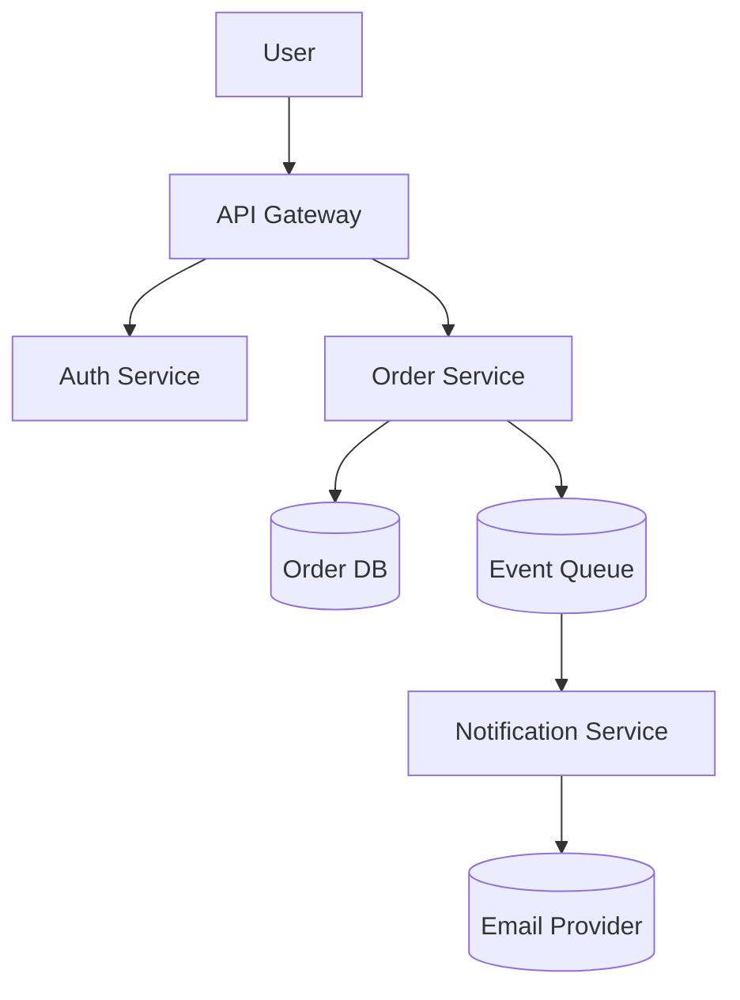

@chapter
id: sa-ch15-decisions-and-diagrams
order: 15
title: Decisions and Diagrams
summary: Recording architectural decisions, communicating designs, and managing risk — the meta-craft of doing architecture, not just having it.

@card
id: sa-ch15-c001
order: 1
title: Architecture Decision Records
teaser: An ADR is a one-page document recording a single architectural decision — context, choice, consequences, date. Cheap to write; invaluable to read three years later.

@explanation

An Architecture Decision Record (ADR) captures the *why* behind a single architectural choice, in a format short enough to actually write and stable enough to read forever.

The standard template:

```markdown
# ADR 0042: Use PostgreSQL for primary data store

Date: 2026-04-29
Status: accepted

## Context

We need a primary data store for the application. Requirements include
ACID transactions, JSON column support, full-text search.

## Decision

We will use PostgreSQL 16 as our primary data store.

## Alternatives considered

- MySQL: similar feature set, but JSON support is weaker.
- MongoDB: better for JSON-heavy work but lacks transactions across documents.
- DynamoDB: managed, scales well, but limited query patterns.

## Consequences

Positive: strong ACID, mature ecosystem, JSON via JSONB columns.
Negative: vertical scaling limits; no built-in horizontal sharding.
Neutral: team knows Postgres; no learning curve.
```

ADRs are stored in source control alongside the code. They're append-only — you don't edit a decision, you supersede it with a new ADR that points back. Over time, the ADR collection becomes the architecture's narrative.

> [!info] Tools that help: ADR-tools (Nat Pryce), Backstage's ADR plugin, Log4Brains. Or a `docs/adr/` directory with markdown files. The format is more important than the tooling.

@feynman

The same shape as a well-written commit message — context, decision, consequence. Future-you will thank present-you for writing it; future-you also won't have any idea what you were thinking without it.

@card
id: sa-ch15-c002
order: 2
title: When to Write an ADR
teaser: Write one for any decision that's hard to reverse, that costs more than a week of engineering, or that future engineers might want to question. Write it when you make the decision, not after.

@explanation

ADRs aren't for every decision. They're for the decisions that:

- **Are hard to reverse.** Database choice, primary language, deployment model, communication style.
- **Cost real engineering.** A week or more of work to implement; longer to undo.
- **Shape future decisions.** Other ADRs will refer back to this one.
- **Are likely to be questioned later.** If someone five years from now might say "why did we do this?", write it down now.

What you don't ADR:

- **Implementation details.** Code-level choices belong in code comments or PR descriptions.
- **Reversible technical choices.** Library version, file structure within a module — these change too often.
- **Team conventions.** "We use camelCase" is a style guide, not an ADR.

A good test: if removing a decision would require a multi-quarter migration, ADR it. If removing it is a refactor in a single PR, don't.

> [!tip] Write the ADR as part of the work, not after. The context and alternatives are clearest when you're in the middle of making the decision; trying to reconstruct them later produces sanitised, less useful records.

@feynman

The same instinct as logging the reason for an unusual `# noqa` or a workaround. Without the note, future-you sees the workaround and refactors it out — re-introducing the bug it fixed. ADRs are the same protection at architecture scale.

@card
id: sa-ch15-c003
order: 3
title: Diagrams That Communicate
teaser: A bad diagram is worse than no diagram. Boxes labelled "service" connected by arrows labelled nothing. Good diagrams have clear notation, named relationships, and one purpose per diagram.

@explanation

A useful architecture diagram has:

- **A clear purpose.** "How requests flow." "What's deployed where." "Who owns what." Not "the architecture."
- **Consistent notation.** A rectangle is a service; a cylinder is a database; an arrow with a solid line is a sync call; a dashed line is async. Pick a notation and stick to it.
- **Labelled relationships.** Arrows say what they represent: `HTTP/JSON`, `gRPC`, `event: OrderPlaced`, not just `→`.
- **Right level of abstraction.** Don't mix high-level architecture with field-level data flow. One diagram, one altitude.
- **A legend.** New readers need to know what shapes mean.

Common bad diagrams:

- **Box-and-arrow soup.** Twelve boxes, twenty-five arrows, no labels.
- **Mixed altitudes.** Some boxes are services; some are functions; some are people.
- **No purpose.** A diagram that tries to show everything ends up showing nothing useful.
- **Stale.** The system has changed; the diagram hasn't. Worse than no diagram.

> [!info] The C4 model (Context, Container, Component, Code) by Simon Brown is a useful framework. Each level has its own diagram with its own purpose. The model's strength is forcing the question "which level is this diagram?"

@feynman

The same as good documentation in any form. The reader's question shapes the document; without a question, you produce a generic page nobody reads. Diagrams need a question they're answering.

@card
id: sa-ch15-c004
order: 4
title: The C4 Model
teaser: Four diagrams at four altitudes — Context (system + external actors), Container (deployable units), Component (modules in one container), Code (only when needed). Use it as a default.

@explanation

The C4 model gives you four standard diagram types, each with a clear purpose:

**1. System Context** — the system as a single box. External actors (users, other systems) connect to it. Top-level view; for stakeholders.

**2. Container** — what's inside the system. Each container is a deployable unit (web app, API, database, queue). For engineering audiences who need to understand the topology.

**3. Component** — what's inside one container. Modules and their relationships. For engineers working on that container.

**4. Code** — UML-style diagrams of classes, sequences, etc. Optional; usually only for the most complex parts.

The discipline is in keeping each diagram at one level. The Context diagram doesn't show database tables. The Component diagram doesn't show external actors. Mixing levels makes diagrams confusing.

Tools that work with C4:

- **Structurizr** — purpose-built for C4 with a code-first approach.
- **Mermaid C4 syntax** — embed C4 diagrams in markdown.
- **Draw.io / Excalidraw** — draw freely with C4 conventions.

> [!tip] Most teams need only Context and Container regularly. Component diagrams come up for specific changes. Code diagrams are rare. Don't over-produce; produce what answers a question.

@feynman

Same as zooming in and out on a map. The world map shows continents; the country map shows states; the city map shows streets. Each is useful at its scale; mixing scales makes the map worthless.

@card
id: sa-ch15-c005
order: 5
title: Architecture Diagrams as Code
teaser: Hand-drawn diagrams age badly. Code-defined diagrams (Mermaid, Structurizr, PlantUML) live in source control, regenerate automatically, and stay current.

@explanation

The diagrams-as-code approach: write the diagram in a text format that gets rendered to an image. The text lives in source control alongside the code; the image is generated.



Benefits:

- **Version controlled.** Diagram changes show up in PRs alongside code changes.
- **Reviewable.** Pull-request review includes the diagram diff.
- **Generated from a source.** Some tools can auto-generate from code (e.g., from imports or service registrations).
- **Portable.** The same source produces images in any docs system.
- **Searchable.** Find references to "Auth Service" in diagrams the same way you find references to it in code.

Languages and tools:

- **Mermaid** — built into GitHub, GitLab, Notion. Easy syntax; good for most diagrams.
- **PlantUML** — older, more powerful, requires a server.
- **Structurizr DSL** — purpose-built for C4; great for layered diagram sets.
- **D2** — newer, focused on modern syntax.
- **Excalidraw + libraries** — when you need looser visual creativity.

> [!info] The 2024-26 trend toward diagrams-as-code is largely a response to the staleness problem. The diagrams in old PowerPoints rot; the ones generated from current code stay current.

@feynman

The same instinct as infrastructure-as-code. The diagram is documentation that lives next to the code, evolves with it, and gets reviewed alongside it. Hand-drawn diagrams are the architectural equivalent of clicking around the AWS console.

@card
id: sa-ch15-c006
order: 6
title: Risk in Architecture
teaser: Every architecture decision carries risk — that the chosen path won't deliver, that costs are higher than expected, that constraints will change. Naming the risks is half of managing them.

@explanation

Risk in architecture isn't a vague feeling; it's a specific category of "this decision could go wrong, in this way, with this consequence." The architect's job includes surfacing the risks so the team can manage them.

Categories of risk:

- **Technical risk.** The chosen technology might not work as advertised. Common with new or specialised tools.
- **Capability risk.** The team might not be able to operate the architecture. Common with stretch architectures.
- **Cost risk.** The architecture might cost more than projected. Common with cloud-heavy designs.
- **Time risk.** The architecture might take longer to build than the schedule allows.
- **Scale risk.** The architecture might not scale to the actual load. Common when load assumptions were optimistic.
- **Compliance risk.** The architecture might not meet regulatory requirements. Common in regulated industries.
- **Vendor risk.** Dependence on a single vendor that might change terms, deprecate, or fail.
- **Knowledge risk.** Only one person understands a critical part. Bus-factor of one.

For each significant risk, the architect documents:

- The risk itself.
- The likelihood (low / medium / high).
- The impact if it materialises (low / medium / high).
- The mitigation plan.
- The monitoring strategy (how do we know the risk is changing).

> [!info] Risk inventories age fast. The risks of last quarter aren't the risks of this quarter. Review every quarter; retire risks that are no longer relevant; add ones that emerged.

@feynman

The same instinct as any project planning. Naming the risks turns "I have a bad feeling" into "this specific thing might fail in this specific way; here's what we'll do." That conversion is most of what risk management is.

@card
id: sa-ch15-c007
order: 7
title: Risk Storming
teaser: A structured exercise where the team identifies risks across the architecture in a workshop. Surfaces what's known unconsciously; converts it into actionable items. One afternoon; outsized payoff.

@explanation

Risk storming (Brian Sletten / O'Reilly community) is a workshop pattern for surfacing architectural risk. The flow:

1. **The architect prepares an architecture diagram** — current state, sufficient detail.
2. **The team gathers** — engineers, ops, security, sometimes product.
3. **Each participant picks a risk dimension** — performance, security, scalability, evolvability, etc.
4. **Each goes through the diagram silently and identifies risks in their dimension** — using sticky notes or a shared doc, marking each risk as low/medium/high.
5. **The team discusses** — consolidating, prioritising, identifying the highest-risk areas.
6. **Mitigations get assigned** — for each high-priority risk, a plan, an owner, a timeline.

The workshop produces:

- A list of risks the team knew but hadn't articulated.
- A consensus on which are most important.
- An action plan for the top ones.
- A baseline for future iterations (re-run quarterly to see what changed).

The exercise is cheap (one afternoon) and high-impact. Most teams discover risks they hadn't surfaced; some teams discover the architecture they thought was safe has serious gaps.

> [!tip] Run risk storming early in a project, not at the end. Early surface lets you change course; late surface produces a list of regrets.

@feynman

The same instinct as a pre-mortem. "Imagine this project failed in six months. Why?" — and the team brainstorms reasons. Surfacing the failures imaginatively lets you avoid them practically.

@card
id: sa-ch15-c008
order: 8
title: Communicating Architecture to Non-Engineers
teaser: Stakeholders can't read C4 diagrams. They need analogies, business outcomes, and risk in their vocabulary. Translation is the architect's job — not optional, not a nice-to-have.

@explanation

The architect serves multiple audiences. Engineering audiences want technical depth; product, business, and executive audiences want different things:

- **Outcomes** — what will the user experience? Faster page loads, fewer outages, more features per quarter.
- **Risks in plain language** — "if the database vendor changes pricing, we'll spend an extra $200K a year."
- **Trade-offs in their terms** — "we can ship in three months on this stack, or six months on a stack we'd prefer technically; the time savings cost us X."
- **Investment requirements** — what does this architecture need from the business? People, budget, time, vendor commitments.
- **Comparisons to known systems** — "this is similar to Netflix's content service, but smaller."

What doesn't translate:

- Technical jargon. Translate or omit.
- Implementation specifics. Stakeholders don't need to know the database flavour.
- Diagrams without context. A C4 Container diagram baffles non-engineers.

The architect who can't translate ends up isolated from business decisions — which means the architecture gets disconnected from what the business actually needs.

> [!info] The translation is itself a skill. Architects who develop it become much more effective; architects who don't get pigeonholed as "the technical person" and stop influencing business decisions.

@feynman

Same as any expert talking to a layperson. The doctor doesn't talk about myocardial infarction; they talk about a heart attack. The architect doesn't talk about CQRS; they talk about why the system can serve more users at the same cost.

@card
id: sa-ch15-c009
order: 9
title: Documentation That Stays Useful
teaser: Architecture docs decay unless they're maintained. Living docs near the code; archived docs as reference; ADRs as history. Pick a structure; commit to maintenance.

@explanation

The maintenance problem: documentation goes out of date faster than anyone updates it. Stale docs are worse than no docs — they actively mislead.

The structure that holds up:

- **Living docs near the code.** READMEs, module docs, API docs. Update on the same PR as the code change. Stay synced because reviewers catch drift.
- **ADRs in source control.** Append-only. Reflect the decision at the time it was made; never edited. Future readers know they're reading history.
- **Diagrams as code.** Generated or hand-coded but text-based. Changes show up in PRs.
- **Wiki for stable reference.** Auth flow, deployment topology, on-call playbook. Expected to stay reasonably current; reviewed quarterly.
- **Slack and email — never.** Knowledge that lives in chat decays into nothing. Promote to docs; don't trust the message archive.

The maintenance discipline:

- **Reviewer responsibility** — code reviewers ask "did the docs change?" when they should have.
- **Periodic audits** — quarterly walks through the wiki; mark stale pages, fix or delete.
- **Owners** — each major doc has a named owner. Without an owner, nobody updates.
- **Templates** — provide templates for common docs (ADR, design doc, runbook). Lower the activation energy.

> [!warning] "Documentation is everyone's responsibility" is "documentation is nobody's responsibility." Assign ownership; treat doc updates as part of the work, not an aside.

@feynman

The same lesson as keeping a codebase clean. Without active maintenance, both decay. The team that doesn't budget for maintenance has docs and code that drift simultaneously — and forgets why they ever worked.

@card
id: sa-ch15-c010
order: 10
title: The Architect's Output
teaser: ADRs, diagrams, risk registers, design docs, conversations. The architect produces written artifacts that outlive any single conversation — and survives the team turnover that loses tribal knowledge.

@explanation

A useful framing: the architect's deliverables are not code. They're written artifacts that future-team-members can read and act on:

- **ADRs** — decisions, with context.
- **Design docs** — proposals for significant changes, with alternatives, trade-offs, and risks.
- **Diagrams** — current state, target state, and the migration between.
- **Risk registers** — what could go wrong, what's being done about it.
- **Runbooks** — how to operate the architecture day-to-day.
- **Onboarding guides** — how a new engineer learns the system.

These artifacts are what the role produces. Code is what individual contributors produce; the architect is producing knowledge artifacts that scale across people, teams, and time.

The discipline that distinguishes effective architects from ineffective ones:

- **Write things down.** If a decision lived only in a meeting, it lived nowhere.
- **Make artifacts discoverable.** If new engineers can't find your work, it doesn't exist.
- **Update or retire.** Stale artifacts mislead; commit to keeping them current or removing them.
- **Optimise for the future reader.** The reader who's never met you, three years from now, who's trying to understand why the system is the way it is.

> [!info] The architects who burn out write code instead of artifacts because code feels productive. The architects who succeed accept that their craft is in writing — and that the leverage of a well-written ADR exceeds the leverage of a particularly clever PR.

@feynman

The shift from individual contributor to manager, applied to architecture. The IC's value is what they produce; the manager's value is what their team produces. The architect's value is what their writing enables others to do — and that requires writing things down.
